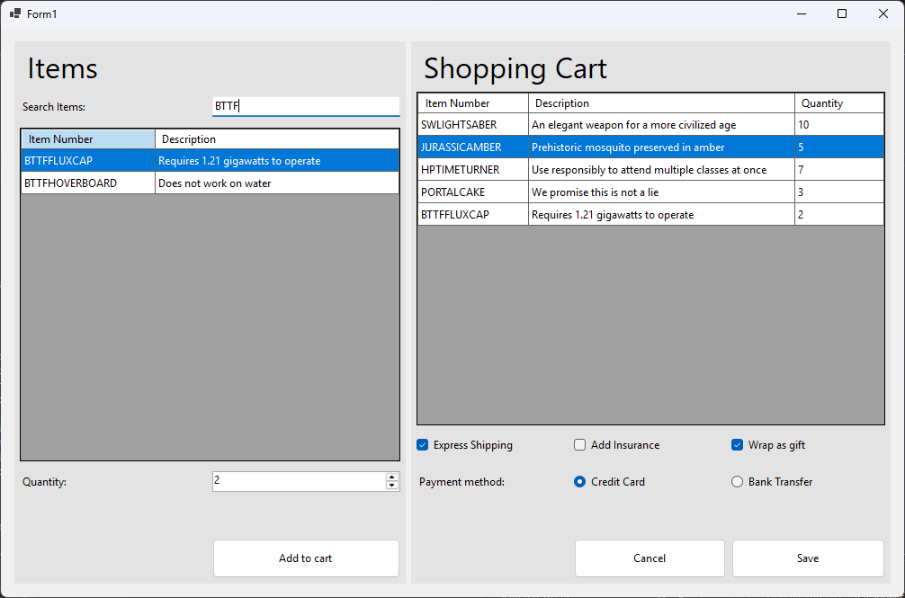
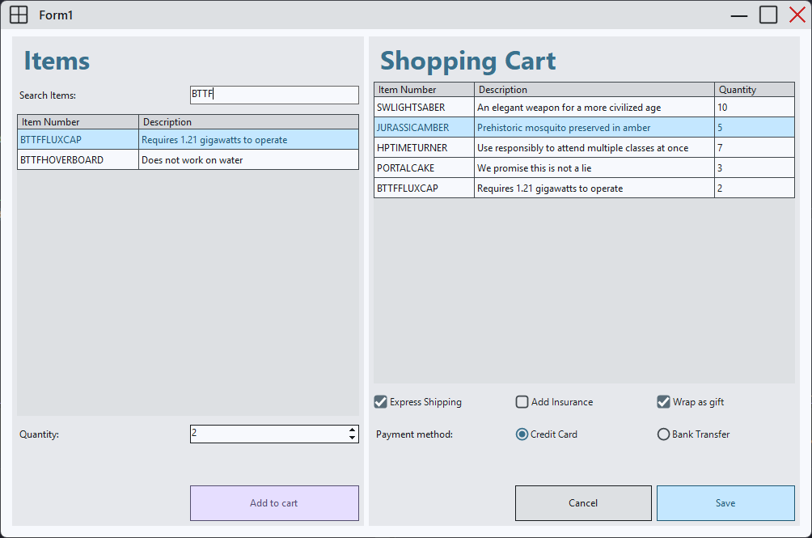
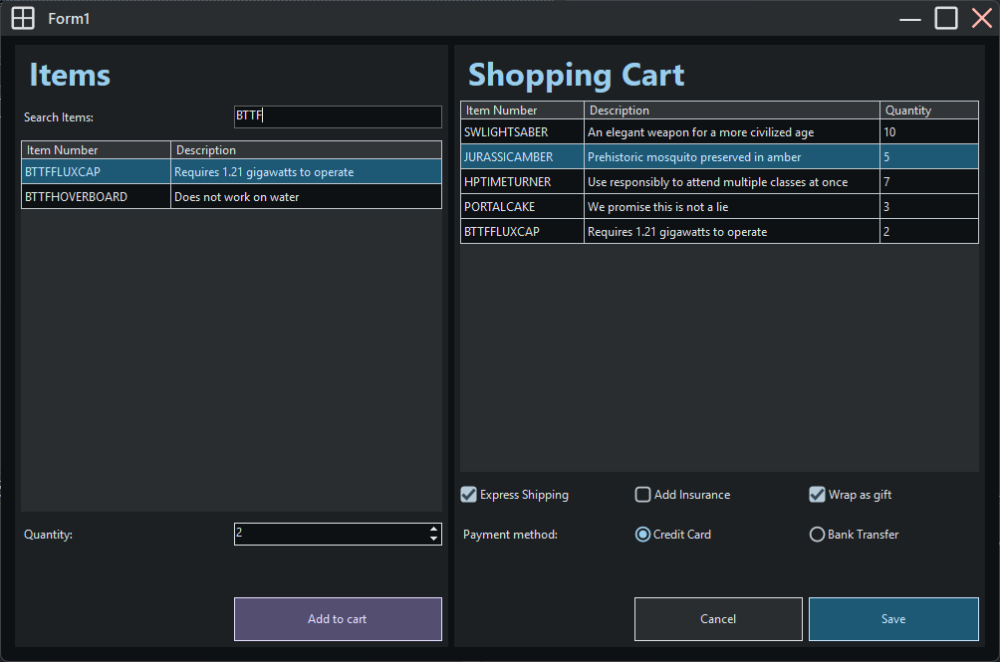
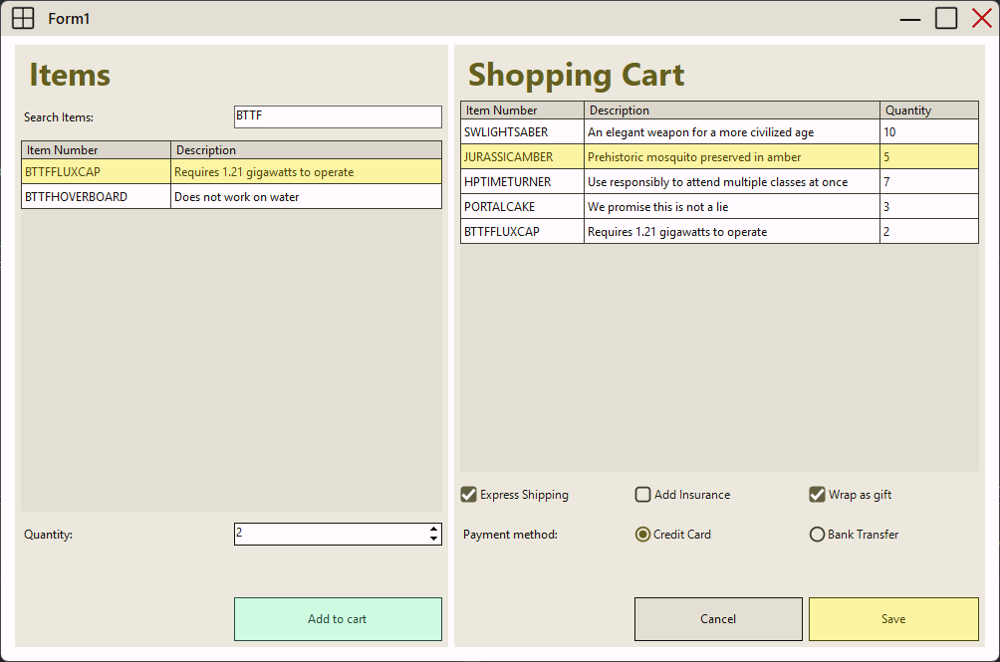
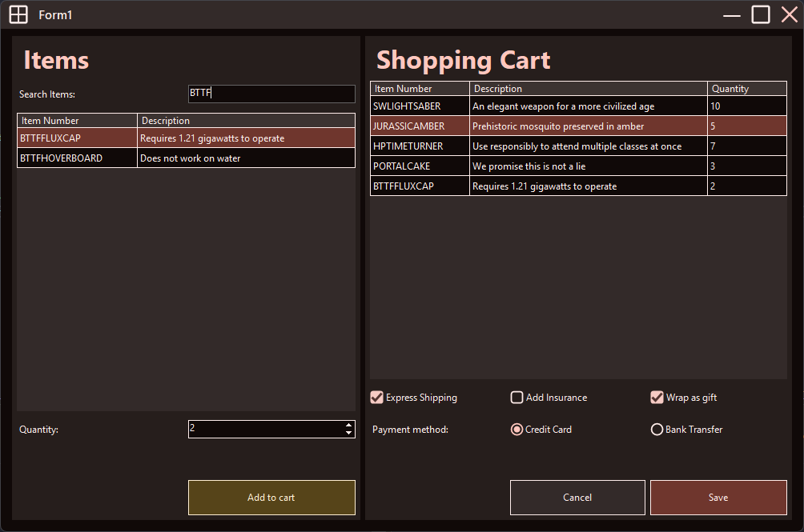
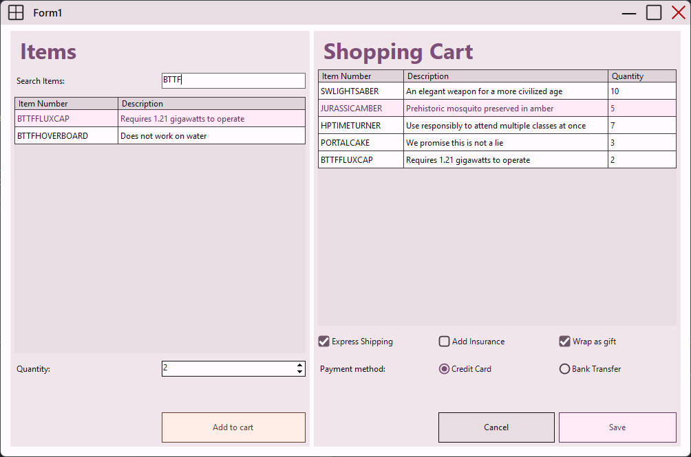
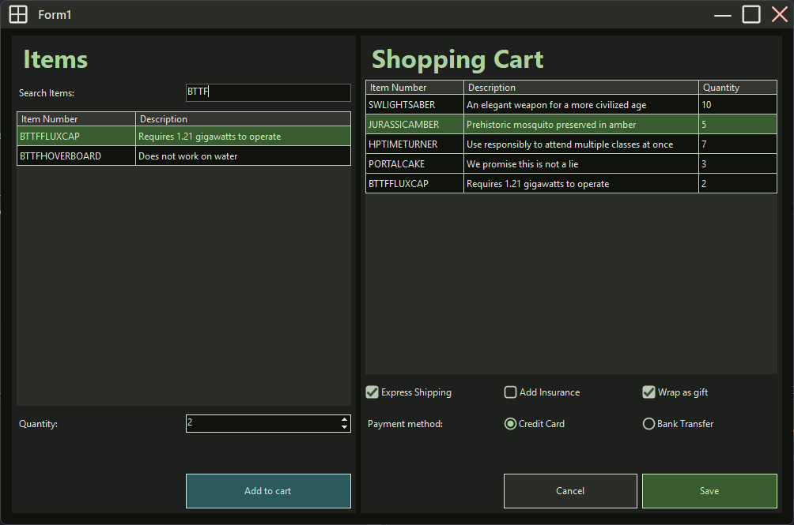
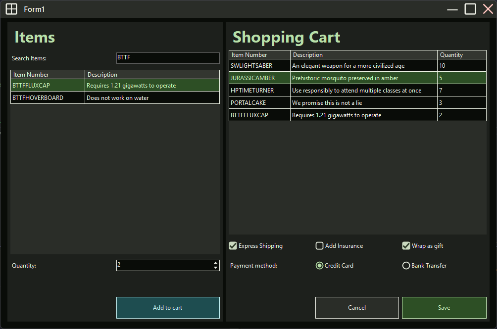
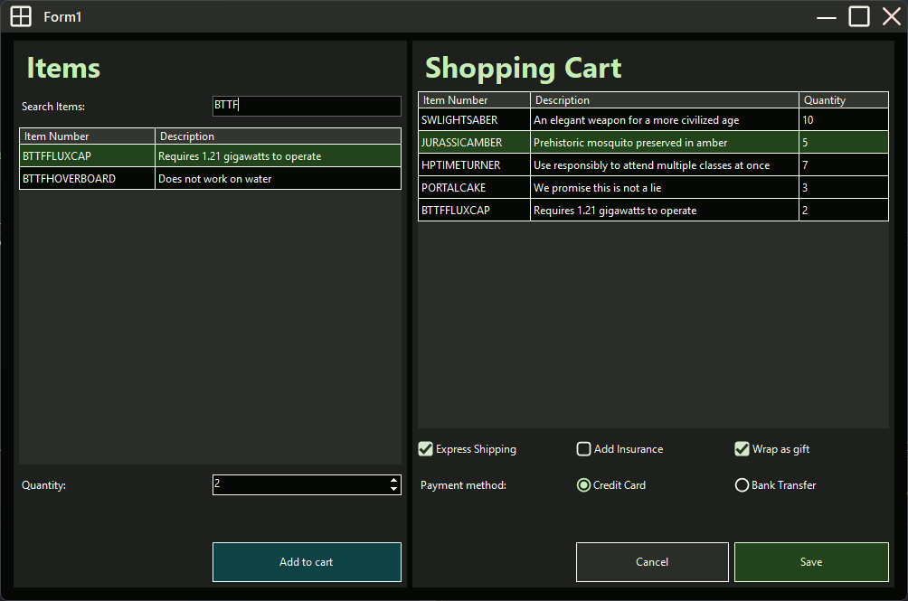

# M2TWinforms: The Makeover Your WinForms Apps Deserve! ✨
Do your powerful Windows Forms applications feel visually stuck in the past? It's time to give that time-tested functionality a fresh, modern UI that users will love.

Say goodbye to the classic, dated interface and hello to a minimalistic, beautiful, and professional material design. With **M2TWinforms**, you can effortlessly give your apps a modern look and feel without having to rewrite your entire project.

## What's Possible: A Quick Preview! 👀
See for yourself how easily you can transform your user interface.  
From the familiar look of native Windows Forms...

...to the minimalist, modern, material aesthetics of M2TWinforms!


### Light Mode vs. Dark Mode 🌗
Easily switch between light and dark themes to reflect your desired visuals and suit your users' preferences.



### One App, Many distinct Appearances 🎨
Apply visual themes to your whole application to give users a consistent look and feel across all forms.  
Easily switch the theme to a different color scheme and let all controls automatically adapt to it.




### Improve Accessibility with Contrast Levels 👥
Ensure your application is accessible to everyone by offering different levels of contrast.
The provided contrast levels include: Normal...

Medium...

... and High Contrast.



## What is M2TWinforms?
M2TWinforms is a UI library that aims to enhance the dated looks of standard Windows Forms.  
M2T stands for: Minimal Material Themeable  
**Minimal**  
The provided controls provida a minimalist flat appearance that goes well with more modern look and feel.  
**Material**  
The colorroles that are utilized to style the controls stem from [Google's Material 3 design guidelines](https://m3.material.io/). Some controls also replace their standard Windows Forms appearance with a Material 3 one.  
**Themeable**  
Theming will be applied to all controls. Making the entire application look and feel more cohesive.  

## Why use M2TWinforms?
M2TWinforms is built on top of standard Windows Forms Controls. This is manifested in the fact that each of the provided controls directly inherits from the corresponding native Windows Forms control. As a result M2TWinforms can be used as a direct drop in replacement for existing applications using native Windows Forms controls.

## How it works
Because the controls directly inherit from their native windows forms counterpart it can be as simple as replacing occurences of windows forms controls with their M2TWinforms counterpart.
```csharp
// using native windows forms
public partial class Form1 : Form

// using M2TWinforms
public partial class Form1 : M2TForm
```

```csharp
// using native windows forms
private Button button1; 
InitializeComponent() 
{
    button1 = new Button();
}

// using M2TWinforms
private M2TButton button1; 
InitializeComponent() 
{
    button1 = new M2TButton();
}
```

>[!NOTE]
>There are plans to write a source generator or Visual Studio Extension that can take care of migrating a whole project to M2TWinforms controls from native WIndows Forms controls.

### Creating a theme
M2TWinforms implements the color calculations found in Google's Material 3 specification.  
With these calculations it is possible to create a theme from a single color. Themes can be created to either suit a dark or light theme. They can also be created for varying contrast levels (normal, medium, high). Additionally to creating a theme from a single color it is also possible to specify each of the colors by hand. This can provide additional freedom when desired.

#### Creating a theme from a single primary color
By only needing to specify a single color, the theme creation is made very simple. The library will take care of calculating the other colors based on the provided primary color.
```csharp
// dark theme from single color (Cyan) with normal contrast and normalizing the chroma
var singleColorTheme = Theme.CreateFromSinglePrimaryColor(
    Color.Cyan, ThemeMode.Dark, ContrastLevel.Normal, true);
```
#### Creating a theme from a json file
A theme can be creted from a json file. The json file can be exported from the [Material Theme Builder](https://material-foundation.github.io/material-theme-builder/).  
Because the Material Theme Builder exports all variants of the created theme, the desired theme mode (light, dark) and contrast level (normal, medium, high) has to be specified explicitly when creating the theme.
```csharp
var themeJsonFile = new FileInfo("material-theme-dark-cyan.json");
var themeFromJson = Theme.CreateFromMaterialDesignJson(
    themeJsonFile, ThemeMode.Dark, ContrastLevel.Normal);
```

>[!NOTE]
>There are plans to switch the theme creation to use the builder pattern as it can be more expressive than traditional method argument approach that is currently being used. See [#31](https://github.com/Muckenbatscher/M2TWinForms/issues/31)


### Applying a theme
The currently loaded theme is managed centrally in the `CurrentLoadedThemeManager`. All controls will apply their theming based on the loaded theme.
To load a theme it is as simple as calling the LoadTheme method. This should be done before any controls are initialized.  

#### By loading an existing theme at application startup
The `Program.cs` is the perfect place for loading a theme because it is executed right at the startup of the application.
```csharp
Theme myDarkTheme = CreateDarkThemeFromSomewhere();
CurrentLoadedThemeManager.LoadTheme(myDarkTheme);
```

#### By implementing IDefaultThemeProvider
It is also possible toa automatically load a theme by providing an implementation of the `IDefaultThemeProvider` interface in your assembly.  
To implement this interface you only have to implement the single method `CreateTheme()`
```csharp
public class MyDefaultThemeProvider : IDefaultThemeProvider
{
    public Theme CreateTheme()
    {
        var theme = Theme.CreateFromSinglePrimaryColor(
            Color.Green, ThemeMode.Light, ContrastLevel.Normal, true);
        return theme;
    }
}
```
When this approach is chosen the theme will even be applied in the Visual Studio Windows Forms Designer. For changes to take effect the project needs to be rebuilt.  
It is advised to only provide one implementation of the `IDefaultThemeProvider` interface. Otherwise one of the implementations from the assembly has to be chosen and the choice may not be deterministic.

>[!WARNING]
>The Visual Studio Forms designer is displayed by the out-of-process `DesignToolsServer.exe` process. This process does not use the projects output directory as its working directory.  
>It is therefore not possible to have a relative path to a theme json file when creating a theme from a json file. Instead it is advised to either use the resources (embedded or .resx) for storing the json or using reflection to build a relative path from the current assembly.


### Assigning colors
Unlike in native windows forms, the colors are not directly assigned to control elements. Instead the M2TWinforms controls expose properties to set color roles. The color roles reflect those that are defined in the [Material 3 design guideline](https://m3.material.io/styles/color/roles).  
These color roles will be translated to an actual color based on the theme that is currently loaded.

>[!NOTE]
>Because the controls inherit from their native windows forms controls they will still have to expose the properties for setting the colors directly. They are however marked as `[Obsolete]` to indicate that the color roles properties should be used instead to ensure proper theming.

The color roles work almost like "paint by number". Assigning a color role property can affect the color of one or more elements within the control. It can also ensure that colors of specific elements work nicely together. A prime example would be a proper foreground text color that provides enough contrast against the background color that is placed on top of.

All controls provide different color roles based on their needs for defined colors and their complexity. They might also allow only the color roles for selection that are valid for a specific property.

## MessageBox
M2TWinforms also includes MessageBoxes. Like with all other controls they can be a simple drop in replacement for the native Windows Forms MessageBoxes.  
The methods to show a MessageBox will also return a `DialogResult` that can be used in the same way as their native Windows Forms counterpart.
```csharp
// native Windows Forms
var dialogResult = MessageBox.Show(
    "Are you sure?", "Confirm", MessageBoxButtons.YesNo, MessageBoxIcon.Question);
if (dialogResult == DialogResult.Yes) { /*do something*/ }

// M2TWinforms
var dialogResult = M2TMessageBox.Show(
    "Are you sure?", "Confirm", MessageBoxButtons.YesNo, MessageBoxIcon.Question);
if (dialogResult == DialogResult.Yes) { /*do something*/ }
```

## Supported controls

| Windows Forms | M2TWinforms  |
| ------------- | ------------ |
| Form          | M2TForm      |  
| Panel         | M2TPanel     |  
| Label         | M2TLabel     |  
| TextBox       | M2TTextBox   |
| RichTextBox   | M2TRichTextBox |
| NumericUpDown | M2TNumericUpDown |
| Button        | M2TButton    |  
| RadioButton   | M2TRadioButton |
| CheckBox      | M2TCheckBox  |  
| DataGridView  | M2TDataGridView |  

